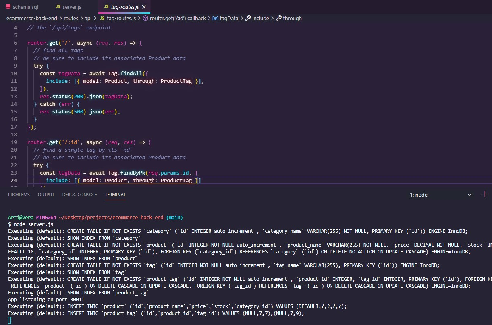
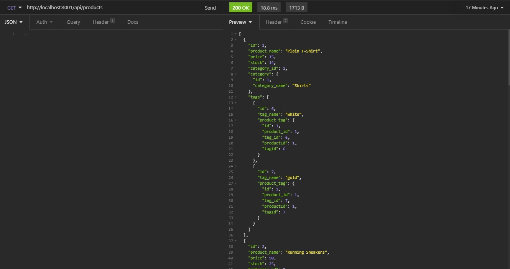
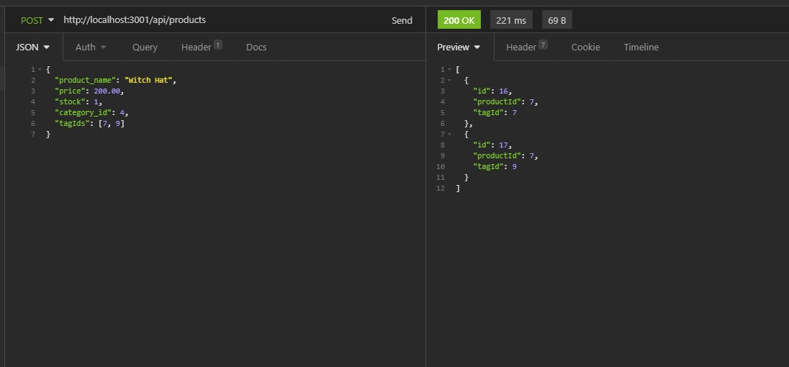

# ECommerce Back End

Using [sequelize](https://sequelize.org/) to build a retail back end and make CRUD happen.  
  
Starter code to set up a database and seed it was given, along with partial routes. 

In order to get things up and running, the following had to be done:
- Set up table comlumns using sequelize syntax for each table
- Create associations between categories and products, as well as products and tags. Categories and products worked as a one-to-many relationship, but tags and products required setting up a many-to-many association.
- Set up appropriate routes for full CRUD functionality with each table, including displaying the appropriate associations on GET (ex - showing the associated tags for a product, and the associated products for a tag)
- Set up sequelize connection and sync models to the database in the server.js file
- Test everything in Insomnia  
  
[Demo Video](https://www.youtube.com/watch?v=fzfdXeGd8GU)  
  
  
Syncing models and starting the server  
  
  
